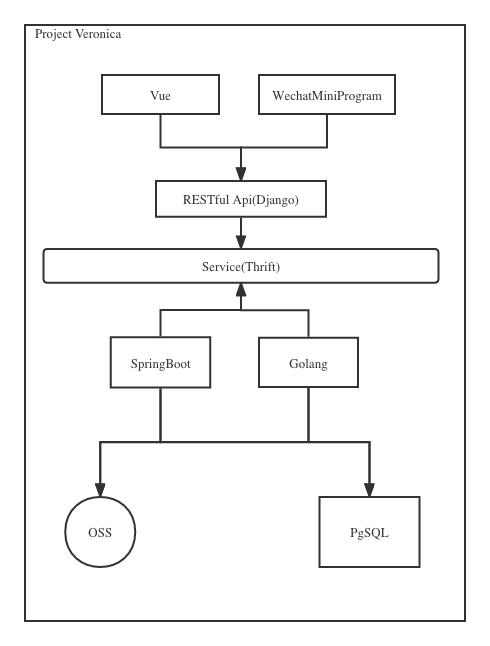

# Project Veronica

All tech blog posts here are written in English(except posts dir's posts,they are backup
from my douban blog logging for life hack), Chinese posts is here(https://silbertmonaphia.github.io/)

## Tech Stack
1.Restful api  
2.Docker  
3.Django[5.2]-python[3.12](PostgresSQL 17.6 + Redis 7.2 ,RabbitMQ 4.0 + ES 8.17)  
4.Gin[1.10]-golang[1.23]:Replace some high traffic slow Django api for faster performance  
5.Thrift RPC?   

Vue 
Gunicorn + Supervisor + OpenResty  
Unittest/Pytest/Coverage 

## Data Types
1.text
2.picture
3.sound track
4.vedio

## Architecture

